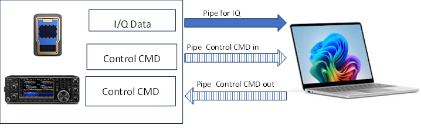

|                                          |
|------------------------------------------|
|                                          |
| [./media/image1.png](./media/image1.png) |
| \|                                       |
|                                          |

Abstract
========

This document covers the IcomIQPort API and Tools. The API is a wrapper of the
FTDI D3xx API, to simplify interfacing with the Icom 7610 IQ interface. The
tools provide tools for finding IC7610 device and recording I/Q data to a SigMF
file. Throughout the document, code snippets are provided showing how to use the
API, and full examples are provided at the end of the document.

Getting the Software
====================

The software is available as part of the IcomIC7610IQ project located at
\<github link\>.

Other Useful Documents
======================

In addition to the software, you should consider downloading the ICOM IC-7610
I/Q Output Reference Guide which provides all the commands for controlling the
radio using the hi speed port. This document is available at \<ICOM Site\> and
requires accepting terms of use.

Prerequisites
=============

I/Q signals and IC-7610 control commands are exchanged through the [USB 2] port
on the IC-7610. Though the driver provided by ICOM, is compatible with FTDI D3xx
driver, **you must install** the Icom Driver. If you install the driver from
FTDI, the driver will fail to find the device. **You need to install** the
driver (USB I/Q Package for HDSDR) that can be downloaded from Icom web site
\<add link\>.

Introduction
============

The FTDI FT600 chip used by Icom, in the IC7600, is configured with three (3)
end points (pipes/ports), CMD_IN (0x82), CMD_OUT (0x02) and IQ_IN (0x84). CMD_IN
and CMD_OUT are used for control commands, between the PC and the IC7610 radio
for radio setting that affect the I/Q output. IQ_IN is used to stream IQ data to
the PC. The full range of IC7610 CIV commands are not available to the IQ sub
system. Only CIV commands that directly impact IQ data, such as frequency, gain,
vfo selection, etc. are available.

*Figure 1:* data pipe diagram for IC7610
----------------------------------------

### I/Q Data Format

The I/Q data is composed of 2 parts: “I” signals and “Q” signals. Each data
length is: “I” =16 bits (2 Bytes), “Q” =16 bits (2 Bytes), (The byte order is in
the little-endian format). The Data Range is -32768 (0x8000) to +32767 (0x7fff).

When reading data from the I/Q port, the number of samples to read must be an
even multiple 128 samples (512 bytes).

### Command Format

You can control the IC-7610 using the CI-V commands. Every command is composed
of a byte array in hexadecimal. Every command must be in increments of 4 bytes.
After sending a command from the PC to the IC-7610, an acknowledgement is
returned. The acknowledgement can be an echo of the command, or ACK (0xFB) or a
NACK (0xFA). A command must be acknowledged before another command is sent.

### Development Environment

The recommended development environment is MSYS2 UCRT64 or MSYS2 MINGW.

For instructions on installing the development environment see the
Getting_Started.md document

Tools
=====

### findDevice.exe 

>   Scans the USP Port to find all ICOM FTDI D3xx high speed devices and prints
>   out the device information, for each. It also prints out the serial number
>   of the first device found, which is the device used by other applications.
>   The assumption is that only a single device is connected (list Icom radios
>   with I/Q out).

>   Open a MSYS2 UCRT64 terminal -\> cd to the \<repo\> directory

>   Usage: bin/findDevice.exe

>   \<Add example output\>

### SigMFWriter.exe

>   Reads data from the Icom IC7610 IQ Port, and stores the data in a file. It
>   also adds a metadata file containing the radio settings, author, and time
>   interval. The default format is CS16 (interleaved complex short).

>   Open a MSYS2 UCRT64 terminal -\> cd to the \<repo\> directory

>   Usage: bin/SigMFFileWriter.exe [-f freq] [-g gain][-i interval] [-t
>   datatype\> [-v vfo] filepath

>   bin/SigMFWriter.exe -h

>   Options:

>   [-f frequency to tune to [Hz]]  
>   [-g gain (default: 10 for auto)]  
>   [ -h help]  
>   [i interval] - the amount of time to record samples in minutes (default 1)  
>   [-t datatype] S16 (16bit short), CS16 interleaved complex short, or  
>   CF32 (complex float for real and imag - Default CS16  
>   [-v VFO] vfo to sample - main or sub - Default main  
>   filepath - required: the file path to store data in.

>   Output: is the data file specified, and a metadata file containing
>   parameters and stats.

>   \<add metadata file example\>

>   If frequency is not provided, the application will use the current frequency
>   as the center frequency for the samples.

>   If gain is not provided, the application will use the current rfgain for the
>   samples.

### IC7610TCPServer

>   Reads data from the Icom IC7610 IQ Port, and send the data to a TCP/IP
>   client connection. Data is not sent until the client connects. The data
>   format is CS16 (interleaved complex short). When connecting to GNURadio, the
>   client should use “short” data type.

>   Usage: bin/IC7610TCPServer.exe -f frequency [-g gain] [-v vfo] port  
>   bin/IC7610TCPServer..exe -h

>   Options:

>   Options:

>   [-f frequency to tune to [Hz]]  
>   [-g gain (default: 10 for auto)]  
>   [ -h help]  
>   [-v VFO] vfo to sample - main or sub - Default main  
>   port - the TCP Port to connect to. Default Port is 6789

>   If frequency is not provided, the application will use the current frequency
>   as the center frequency for the samples.

>   If gain is not provided, the application will use the current rfgain for the
>   samples.

### IC7610TCPClient

>   Reads data from the Icom IC7610 IQ Port, and send the data to a TCP/IP
>   server connection. Data is not sent until the client connects. The data
>   format is CS16 (interleaved complex short).

>   The TCP/IP server must be running before the IC7610TCPClient is started.
>   When connecting to GNURadio, the server should use “short” data type.

>   \<add gnuradio example\>

>   Usage: bin/IC7610TCPServer.exe -f frequency [-g gain] [-v vfo] port  
>   bin/IC7610TCPServer..exe -h

>   Options:

>   [-f frequency to tune to [Hz]]  
>   [-g gain (default: 10 for auto)]  
>   [ -h help]  
>   [-v VFO] vfo to sample - main or sub - Default main  
>   port - the TCP Port to connect to. Default Port is 6789

>   If frequency is not provided, the application will use the current frequency
>   as the center frequency for the samples.

>   If gain is not provided, the application will use the current rfgain for the
>   samples.

### IC7610zmqPush

>   ZeroMQ (zmq) looks like an embeddable networking library but acts like a
>   concurrency framework. It gives you sockets that carry atomic messages
>   across various transports. For more information on GNURadio use of ZeroMQ,
>   see the [GnuRadio
>   Wiki](https://wiki.gnuradio.org/index.php/Understanding_ZMQ_Blocks).

>   The IC7610zmqPush.exe tool, supports the GNURadio ZMQ Blocks push pull
>   model.

>   Reads data from the Icom IC7610 IQ Port, and send the data to a zmq pull
>   device. If there is not zmq pull device ready, the data is dropped.

>   Usage: bin/IC760TCPClient.exe -f frequency [-g gain] [-v vfo] host port  
>   bin/IC760TCPClient.exe -h

>   Options:

>   [-f frequency to tune to [Hz]]  
>   [-g gain (default: 10 for auto)]  
>   [ -h help]  
>   [-v VFO] vfo to sample - main or sub - Default main  
>   host - host ip address or dns name

>   If frequency is not provided, the application will use the current frequency
>   as the center frequency for the samples.

>   If gain is not provided, the application will use the current rfgain for the
>   samples.

IcomIQPort API
==============

Management API
--------------

### IcomIQPort (void) 

>   Used to instantiate the object.

>   Example: IcomIQPort myPort();

### std::string IcomIQPort::getDeviceSerialNum();

>   Searches for a IC7600 on the USB bus, and returns the first found device.
>   The returned value is a std::string;

>   Example: std::string devSerialNum = IcomIQPort::getDeviceSerialNum();

### void init (std::string deviceSerialNum);

>   Initialize the device. Using the serial number (deviceSerialNUM) attaches
>   the device to the object and opens the device for use.

>   Example: myPort.init(deviceSerialNumber);

### \~IcomIQPort()

Deletes the object - cleans up, closes the device connection, free the device

### void close();

>   Closes the device.

>   Example: myPort.close();

### std::string version()

>   Returns the software version number

>   Example: std::cout \<\< “Version: “ \<\< myPort.version() \<\< std::endl;

Status APIs
-----------

### bool isInitialized()

>   Returns true if the object has been initialized. The object must be
>   initialized before it can be used.

>   Example: if (!myPort.isInitialized())  
>   throw std::runtime_error(“I/Q port not initialized”);

### bool isOpen(void)

>   Returns true if the port is opened. If the port is not opened, the device is
>   closed, but not disconnected. This allows the Async reader to process
>   buffered data before disposing of the object. To reopen you will need to
>   reinitialize.

### bool isIQDataEnabled(void)

>   Returns true if IQ Data Port is enabled. The IC7610 will not send data if
>   the port is disabled.

Control APIs
------------

### bool disableIQData(void)

>   Disables the IQ Data. Returns true if successful. When the IQ Port is
>   disabled, the device will not send data. The command to enable and disable
>   IQ data is the same, with different data values (e.g. 0 for OFF, 1 Main VFO,
>   2for Sub VFO). disableIQData always send a zero (0) value.

>   Example: myPort.disableIQData();

### bool enableIQData(uint8_t source)

>   Enables IQ Data Flow. Returns true is successful. The Source is either the
>   main or sub vfo. For compatibility, main is 0 and sub is 1. To adjust the
>   for this call, we add one to the vfo value.

>   Example: myPort.enableIQData(1); // enable IQ data for main vfo.

### int getTimeout(uint8_t channelID) 

>   gets the timeout for a pipe (e.g. CMD_IN, CMD_OUT, IQ_IN). Returns timeout
>   in ms

>   Example: ulong timeout = myPort.getTimeout(IQ_IN);

### void setTimeout(uint8_t channelID, int timeOut)

>   sets the timeout for a pipe (e.g. CMD_IN, CMD_OUT, IQ_IN). timeOut value is
>   in ms.

>   Example: myPort.setTimeout(5000); //set timeout to 5 seconds

### int iqGetRFGain(uint8_t vfo

int iqGetRFGain(uint8_t vfo);

### int iqSetRFGain(uint8_t vfo, int rfgain);

int iqSetRFGain(uint8_t vfo, int rfgain); //rfgain must be a value between 0 and
255

### int iqGetPreAmpStatus(uint8_t vfo);

int iqGetPreAmpStatus(uint8_t vfo);

>   Returns 0 = off, 1 =PAMP1 On, 2 = PAMP2 On

uint8_t iqGetAttenuatorSettings(uint8_t vfo);

>   attenuation settings are in 3db increments to 45

uint8_t iqSetAttenuatorSettings(uint8_t vfo, int attenuation);

attenuation settings are in 3db increments to 45

std::string iqGetAntenna(uint8_t vfo);

int iqSetAntenna(uint8_t vfo, int antenna, bool status);

int iqGetFrequency(uint8_t vfo);

int iqSetFrequency(uint8_t vfo, uint32_t frequency);

bool iqGetDIGI_SEL_Status(uint8_t vfo);

void iqSetDIGI_SEL_Status(uint8_t vfo, bool status);

//Intermodulation Performance Plus IP+

bool iqGetIP_Status(uint8_t vfo);

>   /Intermodulation Performance Plus IP+

void iqSetIP_Status(uint8_t vfo, bool status);

int iqAbortPipe(uint8_t pipe=pipe)

pipe = CMD_IN (0x82) , CMD_OUT (0x02), IQ_IN (0x84)

Data API
--------

>   int readIQData( std::complex\<short\> \*buffer, size_t buffer_size,void\*
>   overlapped\_ = NULL);

>   Synchronous read of samples if overlapped is NULL. It you want to use
>   Asynchronous calls; you will need to provide a Windows overlap structure and
>   a call back routine to read the data.

Async API
---------

The IcomIQPort library provides a and asynchronous library to handle high speed
data streaming.

bool iqAsyncStart(uint8_t vfo)

>   Start asynchronous data processing on vfo (main (0x00), sub (0x01)

void iqAsyncStop(void)

>   stop asynchronous processing

int iqReadBuf(std::complex\<short\> \*data, size_t numSamples)

>   Read n samples from the asynchronous buffer

size_t iqGetSizeOfAvailableData()

>   Returns the number of samples available in the async buffer

void iqClearReadBuf( void) {iqBuffer_.clear_ringbuffer();}

>   Clear the async ring buffer after stopping

Low Level Functions
-------------------

bool sendIQCommand( std::vector\<uint8_t\> cmd);

>   send a CI-V command to IC7610 I/Q port

int readIQReply( std::vector\<uint8_t\>& buffer);

>   read CIV response from IC7610 I/Q port

int icomIQCommand( std::vector\<uint8_t\> cmd, std::vector\<uint8_t\> \&reply);

>   sends a CIV command IC7610 and reads the reply

int read_bcd(int n)

>   convert a uint32\_ to bcd digit

int bcd_digits(uint32_t n, int value)

>   converts a uint32_t to a vector of bcd digits
